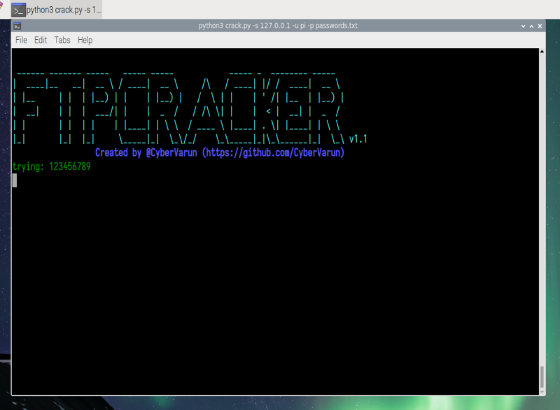
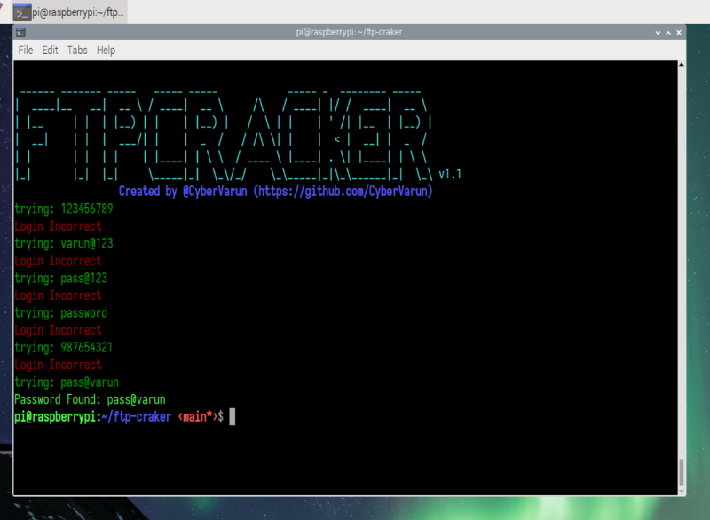
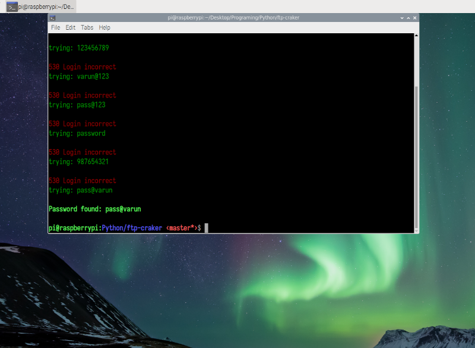

## Summary
	This is simple python FTP password craker. 

<hr>

## Requriments
	` pip install ftplib `

<hr>

## Installation

```
git clone https://github.com/CyberVarun/ftp-craker.git 
cd ftp-craker
python3 craker.py 
```
## Usage

```
usage: crack.py [-h] [-s SERVER] [-u USER] [-p PASSFILE]

optional arguments:
  -h, --help   show this help message and exit
  -s SERVER    specify server IP
  -u USER      specify user
  -p PASSFILE  specify password file

```
## Tested on 

Raspberry Pi OS

## Preview



