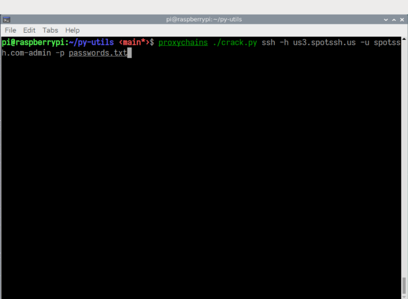
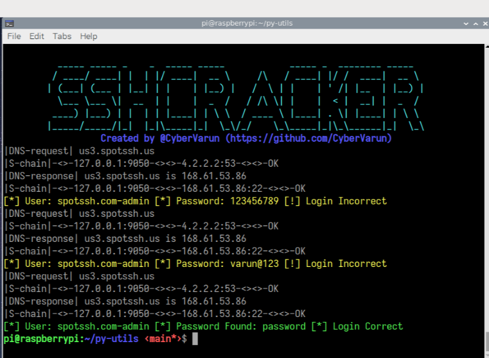
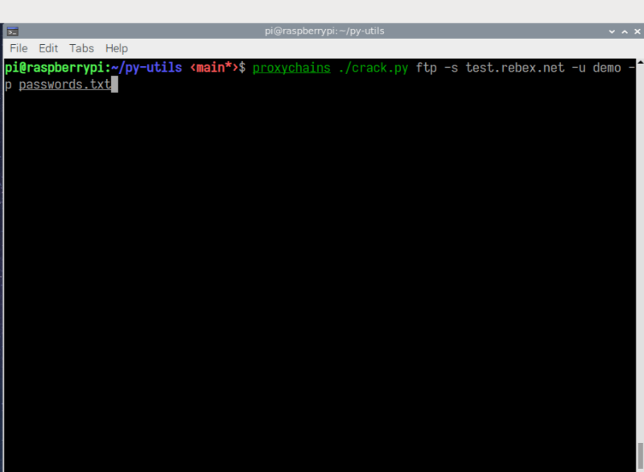
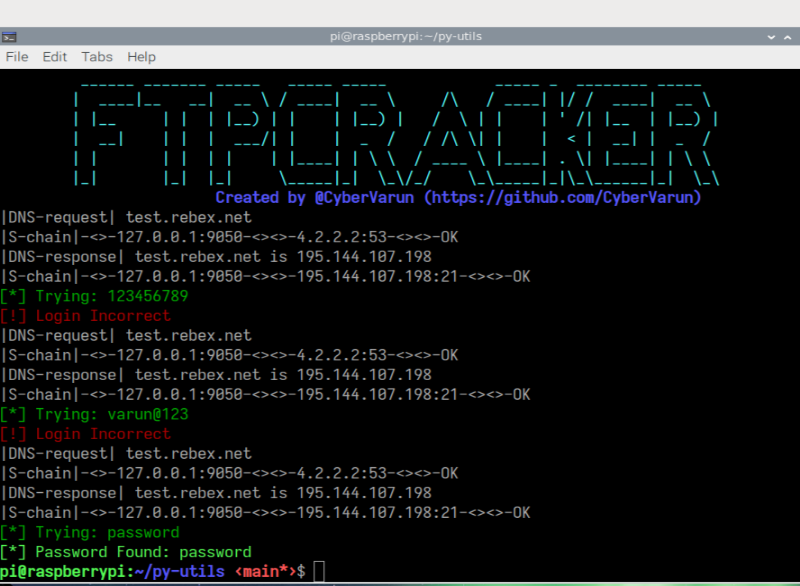

# Disclaimer

This tool is for Educational purpose only. We do not promote or encourage any illegal activities.

<hr>

## Summary

These are Simple python scripts to test/scan your network.

<hr>

## Installation

```bash
curl https://raw.githubusercontent.com/CyberVarun/py-utils/main/install.sh | bash
cd py-utils/
python3 main.py --help 
```
<hr>

#### Usage

```python
Usage: main.py [OPTIONS] COMMAND [ARGS]...

Options:
  --help  Show this message and exit.

Commands:
  crack   Set of tools to crack FTP, SSH login and md5 hash.
  scapy   Set of tools to scan/test network (using scapy module).
  socket  Set of tools to scan/test network (using socket module).

```

##### SSH


##### FTP


<hr>

## Rockyou.txt

Rockyou.txt has been removed from repo but you can download it from <a href="http://mirror.anigil.com/kali/pool/main/w/wordlists/wordlists_0.3.orig.tar.gz">here</a> (official link from kali mirror.)
Rockyou wordlist is a password dictionary used to help to perform different types of password cracking attacks. It is the collection of the most used and potential passwords.

## Tested on 

Raspberry Pi OS
<hr>
